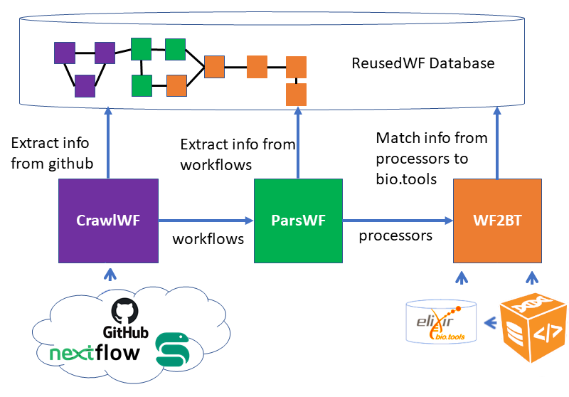

# Repositories

During [my PhD](https://theses.fr/2023UPASG059), I studied bioinformatics workflows, specifically workflows written in the next generation systems Nextflow and Snakemake.
My aim was to understand how workflows are actually used by the bioinformatics community, and to identify reuse practices.
Here is an overview of the main repositories linked to that project.

## Collecting and transforming the data

In order to study reuse practices, I first had to collect workflows.
Databases specifical to workflows containing rather small amounts of Snakemake and Nextflow workflows, I chose to gather workflows present on public GitHub repositories in order to get the largest amount.

To compare workflows, it is crucial to know the workflows' *function*, or the bioinformatics operations that the workflows are performing.
As this information was not readily available in the repositories metadata, I had to analyze the workflows' code. To know which bioinformatics operations they perform, I extracted the bioinformatics tools they contain. In order to get more precise information, I used other databases, in particular [bio.tools](https://bio.tools/), which was used to get semantic annotations of bioinformatics tools in the [EDAM](https://edamontology.org/EDAM.owl) ontology. 

|  |
| :--: |
| *Workflow extraction and annotation process. It is composed of three major units : i) CrawlWF retrieves and extracts GitHub workflows, ii) ParsWF analyses the workflows to extract significant information, and iii) WF2BT retrieves the bio.tools annotations linked to the workflows' tools.*[[1]](#1) |

This process was first elaborated and implemented for Snakemake workflows in 
[this repository](https://github.com/mdjaffardjy/Snakemake_workflow_analysis).

During interships that I supervized, it was adaptated on Nextflow workflows, and the resulting tool can be found in [this repository](https://github.com/mdjaffardjy/AnalyseDonneesNextflow).

The output of those tools were annotated workflows, and this information was later stored in a relational database as well as a knowledge graph (a semantic web representation of the data). Those representations aimed to be universal to workflows written in all languages.

## Analyzing the data

After collecting the workflows, I conducted investigations on the reuse in the Nextflow and Snakemake systems. 
This investigation was conducted at several levels (reuse of steps, reuse of code, reuse of tools) by proposing similarity metrics and applying them to the corpus.
The results can be found in [this repository](https://github.com/mdjaffardjy/Reuse_in_processes).

During an internship I co-supervized, a [similarity study](https://github.com/mdjaffardjy/graph_parsing) focused on the structure of the workflows was also conducted on the graphs, using graph comparison algorithms such as graphmdl and gspan. 

### References
<a id="1">[1]</a> 
Developing and reusing bioinformatics data analysis pipelines using scientific workflow systems,
Djaffardjy et al.,
Computational and Structural Biotechnology Journal, Volume 21, 2075 - 2085

